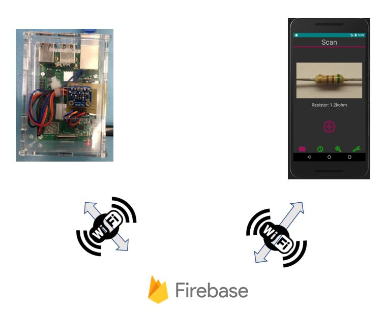

# RVR(Resistor Value Recoganizer) 
## Build Insructions for Luminosity Sensor - TSL2591 from Adafruit




The build instructions given below work with Adafruit's luminosity sensor- TSL2591, which will be integrated in the project Resistor Value Recognizer. The TSL2591 sensor measures the light of the environment in lux. The values obtained from the sensor will be used to control LEDs in the final project to provide adequate lighting to the camera.

These build instructions will demonstrate the process to design, program and build a PCB for the sensor to connect it to a broadcom development platform. The sensor in this tutorial is working with Raspberry Pi 3B+ and will provide the design file for a laser cut acrylic case along with references to all the resources that will be needed for the creation of this project.

The final design and build of the project can be seen below:
<p align="center">

</p>

### Table of Contents 

[Parts Required](https://github.com/HusnalK/Resistor-Value-Recognizer-RVR#Parts-Required)

[Time Commitment](https://github.com/HusnalK/Resistor-Value-Recognizer-RVR#Time-Commitment)

[Step 1- Raspberry Pi Setup](https://github.com/HusnalK/Resistor-Value-Recognizer-RVR#Step-1--Raspberry-Pi-Setup) 

[Step 2- Breadboarding](https://github.com/HusnalK/Resistor-Value-Recognizer-RVR#Step-2--Breadboarding)

[Step 3- Uploading Code and Testing ](https://github.com/HusnalK/Resistor-Value-Recognizer-RVR#Step-3--Uploading-Code-and-Testing)

[Step 4- PCB Etching, Soldering and Power Up](https://github.com/HusnalK/Resistor-Value-Recognizer-RVR#Step-4--PCB-Etching-Soldering-and-Power-Up)

[Step 5- Case Laser Cutting and Assembling](https://github.com/HusnalK/Resistor-Value-Recognizer-RVR#Step-5--Case-Laser-Cutting-and-Assembling)

[Step 6- Final Power Up And Testing](https://github.com/HusnalK/Resistor-Value-Recognizer-RVR#Step-6--Final-Power-Up-And-Testing)

[Production Testing](https://github.com/HusnalK/Resistor-Value-Recognizer-RVR#Production-Testing)

[Conclusion](https://github.com/HusnalK/Resistor-Value-Recognizer-RVR#Conclusion)


### Parts Required

Given below is the list of all the parts that might be required in this project. It is taking into consideration that you have facilities for safe soldering and powering up the project. 

| Description                    | No. of Each  Parts Required | Source  | Cost of Each Part   (CAD) | Link                    |
|--------------------------------|-----------------------------|---------|---------------------------|-------------------------|
| Raspberry Pi 3 b+  Motherboard |       1                     | Amazon  | $ 79.97                   | https://amzn.to/2ruQ5ua |
| Raspberry Pi Power Supply      |       1                     | Amazon  | $ 12.98                   | https://amzn.to/2YyIirt |
| Micro SD Card (32 GB)          |       1                     | Amazon  | $ 10.68                   | https://amzn.to/356bubr |
| Adafruit TSL2591 Lux Sensor    |       1                     | DigiKey | $ 9.97                    | https://bit.ly/2lTpzYk  |
| Ethernet Cable                 |       1                     | Amazon  | $ 8.29                    | https://amzn.to/2LBMQaY |
| USB 3 to Ethernet Adaptor      |       1                     | Amazon  | $ 20.05                   | https://amzn.to/2RB8HmJ |
| Stackable Pin Header Kit       |       1                     | Amazon  | $ 19.98                   | https://amzn.to/2PyRhVc |
| 40x20cm Female to Female Wires |       1                     | Amazon  | $ 6.99                    | https://amzn.to/2RHou3L |
| Acrylic Plexiglass Sheet       |       1                     | Amazon  | $ 19.99                   | https://amzn.to/2Ry0JLj |
| Screws (M2.5)                  |       4                     | Digikey | $ 0.15                    | https://bit.ly/2t4eDuB  |
| Nuts (M2.5)                    |       4                     | Digikey | $ 0.32                    | https://bit.ly/355WCdt  |
Total = 190.78 CAD

I am using a Raspberry Pi 3b+ as my broadcom development platform. The micro SD card is used to upload the Raspbian and set up the Raspberry Pi. Some of these supplies like Raspberry Pi and its power supply, micro SD card, header and wires, ethernet cable and Acrylic glass sheet, might already be available with a lot of people doing this project and that greatly reduces the cost of the project. I also bought a USB 3 to Ethernet Adaptor to connect my Raspberry Pi to my laptop using SSH and RDP. This part from Amazon does not require any drivers to be downloaded on Windows.  

An alternate for a laser cutting machine is getting the Acrylic sheets already laser cut. Submit the following Corel Draw file on the website, chose the colour of acrylic and pay for it together. One such website that can help with this is : [Acrylic Laser Cutting Service](https://www.ponoko.com/laser-cutting/acrylic). 

[CorelDraw File](https://github.com/HusnalK/Resistor-Value-Recognizer-RVR/blob/master/Mechanical/HusnalPi2CaseX6New.cdr) 

Edit the file according to your needs.

The original design for the case can be found here: [Original CorelDraw File](https://github.com/diy-electronics/raspberrypi-b-plus-case) 

You can also get your PCB made and shipped to you by converting the following Fritzing file to a Gerber file.

[Fritzing File 2](https://github.com/HusnalK/Resistor-Value-Recognizer-RVR/blob/master/Electronics/PCB2.fzz) 

A Sevice that can help with this is: [JLCPCB](https://jlcpcb.com/).

Also, an important thing to note is that the table above only shows the cost of the part; Taxes, shipping, duty, and import fee might still be laid on top of these prices depending on where you live. This may cause an increase in the cost of the project.

My budget can be found [here](https://github.com/HusnalK/Resistor-Value-Recognizer-RVR/blob/master/Documentation/Budget.pdf). The steep difference from the amount given in the above table and my budget is due to the fact that I already had a Raspberry Pi kit which had all its essentials in it and I was also able to procure a lot of materials from the prototype lab in my college, which also provided me the space to do all my testing and laser cutting.

### Time Commitment

The schedule that was followed by me, ([Schedule](https://github.com/HusnalK/Resistor-Value-Recognizer-RVR/blob/master/Documentation/CapstoneGProject.pdf)) is based on a weekly basis as required by my course. 

However, for a person who:
* has all the parts procured along with a Raspberrry Pi which has Raspbian installed and booted up
* is proficient in soldering and other electronics aspects like wiring and PCB designing, etc
* can upload and run the code on Raspbian
* has all the machinery like the laser cutter and soldering necessities nearby

the estimated time it might take to recreate the same project is as follows:

|                 Task                 |    Time    |
|--------------------------------------|------------|
| Breadboarding                        | 15 minutes |
| Uploading Code and Testing           | 20 minutes |
| PCB Laser Cutting and Etching        | 60 minutes |
| PCB Soldering                        | 15 minutes |
| PCB Power-Up                         | 10 minutes |
| Laser Cutting Case                   | 20 minutes |
| Case and PCB Assembly                | 25 minutes |
| Final Power-Up and Testing           | 20 minutes |
Total Time = 185 minutes = 3 hours 5 minutes

Therefore, the project can be developed in one weekend. However, it is important to remember that some things may increase the time frame, for example- it may take weeks for the parts to arrive or the PCB was not etched properly the first time or breadboarding was incorrectly done, or the machinery was not available on-site, etc.

### Step 1- Raspberry Pi Setup

The following resources can be used to download Raspbian on a Raspberry Pi and boot it. Resources are also given on how to set up SSH and Remote Desktop on it too.

##### -> Setting up Raspberry Pi
* https://www.raspberrypi.org/downloads/raspbian/
* https://www.raspberrypi.org/documentation/installation/installing-images/README.md
* https://www.youtube.com/watch?v=wvxCNQ5AYPg

##### -> Setting up SSH and RDP
* https://www.youtube.com/watch?v=IDqQIDL3LKg
* http://www.circuitbasics.com/access-raspberry-pi-desktop-remote-connection/
* https://www.raspberrypi.org/documentation/remote-access/ssh/

While setting up the Raspberry Pi, don't forget to enable the I2C bus in the same way as enabling SSH and RDP. It will be used later by the code to interface between the Raspberry Pi and the sensor. 
### Step 2- Breadboarding 

You can use the fritzing files made by me to get started on your breadboarding. The connections can be found in it. ([Fritzing File](https://github.com/HusnalK/Resistor-Value-Recognizer-RVR/blob/master/Electronics/PCB.fzz))
Another resource that can be used for finding the right connections is [this part](https://learn.adafruit.com/adafruit-tsl2591/python-circuitpython#python-computer-wiring-6-3) from a Adafruit webpage.


It is important to test the validity of the the connections and the sensor before printing the PCB, so assembling the connections of the sensor to the Raspberry Pi on a breadboard, as shown below, is important.  


### Step 3- Uploading Code and Testing 

The code that I uploaded is refered from [this](https://learn.adafruit.com/adafruit-tsl2591/python-circuitpython#circuitpython-installation-of-tsl2591-6-5) webpage can be found here: [Sensor Code](https://github.com/HusnalK/Resistor-Value-Recognizer-RVR/blob/master/Software/tsl2591_test.py). 

In some cases the user might need to follow the steps given in the original refrence to download [CircuitPython](https://github.com/adafruit/Adafruit_CircuitPython_TSL2591#installing-from-pypi) and the [CircuitPython librabry bundle](https://github.com/adafruit/Adafruit_CircuitPython_Bundle#cpython).

To run the code, move into the right directory on the command terminal and then use the command ```python tsl2591_test.py```. The output will display the light intensity in lux units as sensed by the sensor.


All the connections together can be seen below:


### Step 4- PCB Etching, Soldering and Power Up

The fritzing file provided below should be converted to a Gerber file and then used to get the PCB etched. Don't forget to edit out my name.

[Fritzing File 2](https://github.com/HusnalK/Resistor-Value-Recognizer-RVR/blob/master/Electronics/PCB2.fzz) 

 

Now Solder the headers onto it as shown below:
(TIP: Always wear safety glasses while Soldering)

 


### Step 5- Case Laser Cutting and Assembling

In this project, I am using a clear acrylic for my case since it will make it easier for the sensor to sense the light of the surroundings. The CorelDraw file provided below can be used to assemble this project properly. This case has a slit the size of the breadth of the PCB which can be slid into it and the wires can be connected from the sensor to the Raspberry Pi pins efficiently. The reason I am using wires inside the case instead of just mounting the sensor on top of the pins of the Pi directly is to make sure that pins that are not in use by the PCB are available for future use if needed.

Again, don't forget to edit out my name and the name of this project! 

[CorelDraw File](https://github.com/HusnalK/Resistor-Value-Recognizer-RVR/blob/master/Mechanical/HusnalPi2CaseX6New.cdr) 

The original design for the case can be found here: [Original CorelDraw File](https://github.com/diy-electronics/raspberrypi-b-plus-case)  

Now, screw in the Raspberry Pi motherboard and assemble the case with the PCB in the slit. I used a zip-tie to neatly fold my wires inside the case, you can always use shorter wires.

 

 

 

### Step 6- Final Power Up And Testing

Connect the Raspberry Pi in the case to the computer and repeat whatever is needed in [Step 3](https://github.com/HusnalK/Resistor-Value-Recognizer-RVR#Step-3--Uploading-Code-and-Testing) to finally run the completed project and run the testings.

The final project connected to my laptop along with the output can be seen below:


### Production Testing

While creating this project for production, some steps like breadboarding for each unit and testing the connections using the code before assembling the PCB can be eliminated. Instead, it is easier and faster to test the connections of multiple PCBs using a multimeter to eliminate the risk of short-circuiting. Breadboarding should only be done once, before the commission of mass production of the PCBs. 

The final testing can be done efficiently by connecting the Raspberry Pi to a computer and inserting a preloaded SD card in the PI which also has the code inside it. 

### Conclusion
Hence, the project is easily reproducible by the given instructions. A person can change the project according to their needs but this is one way of working with an Addafruit TSL2591 sensor.

### [Table of Contents](https://github.com/HusnalK/Resistor-Value-Recognizer-RVR#Table-of-Contents)
