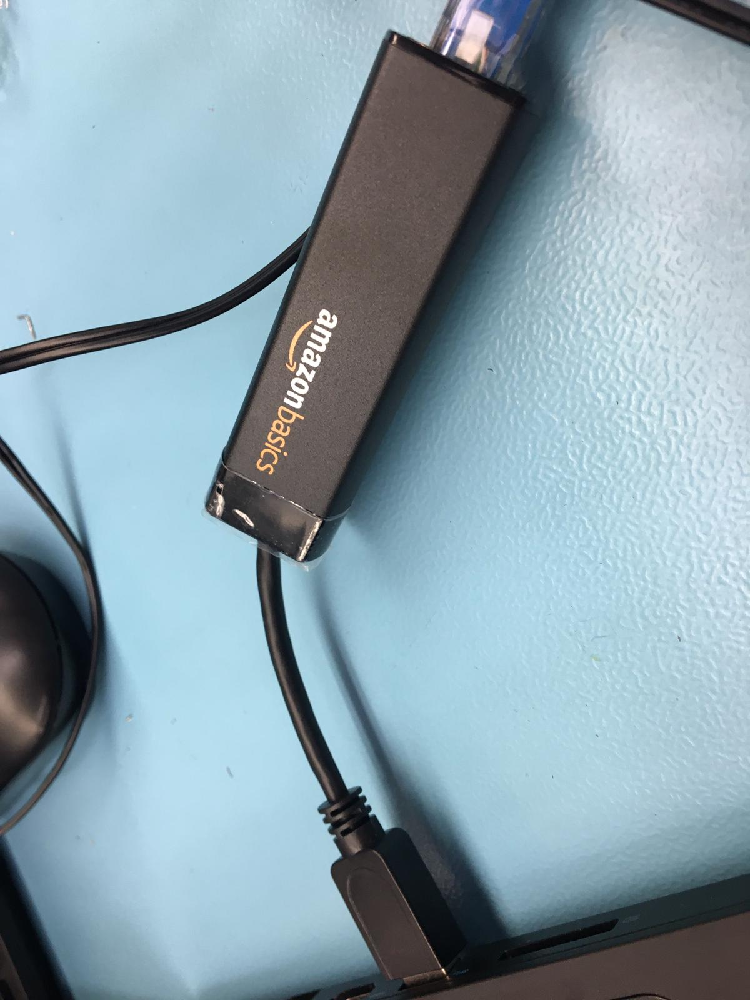
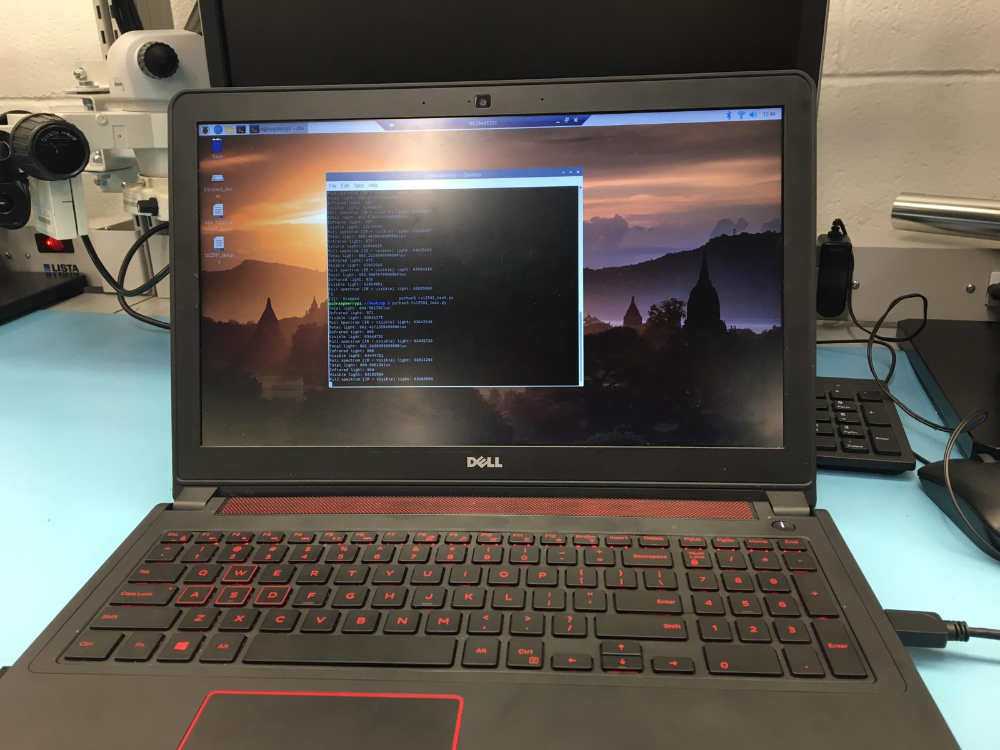
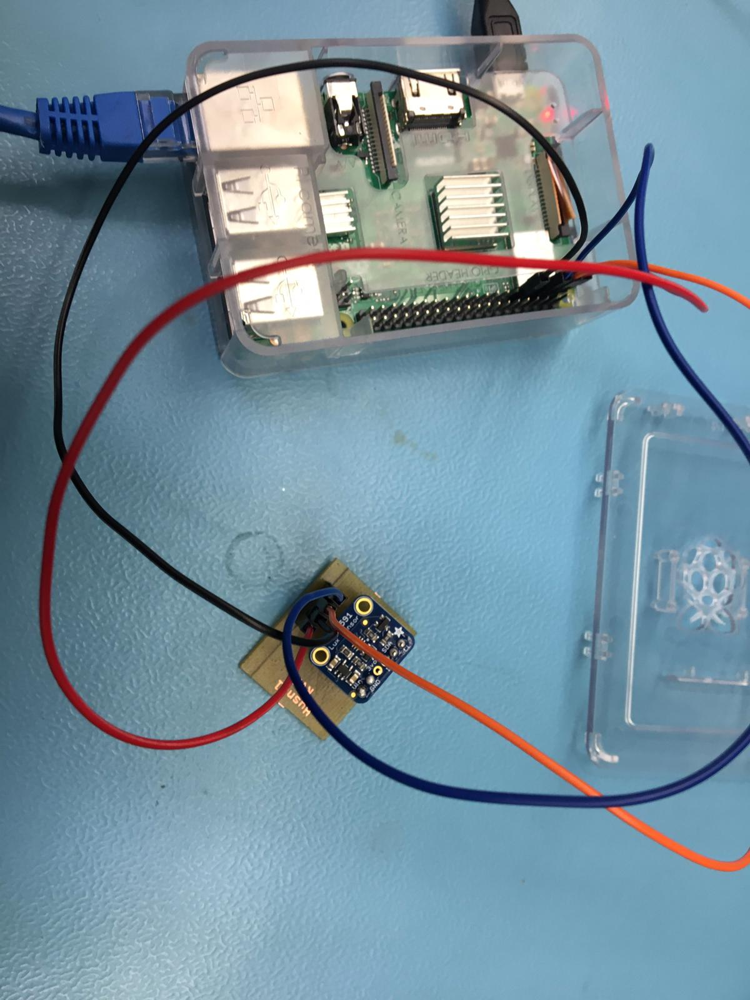
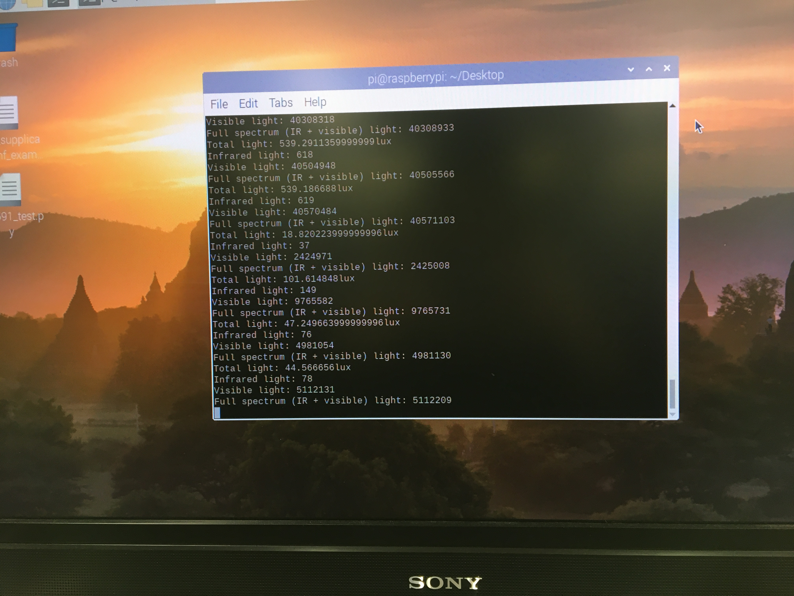
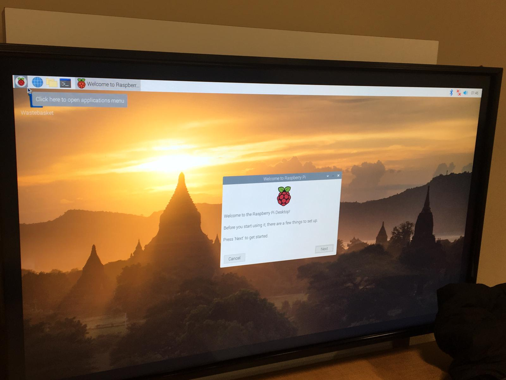
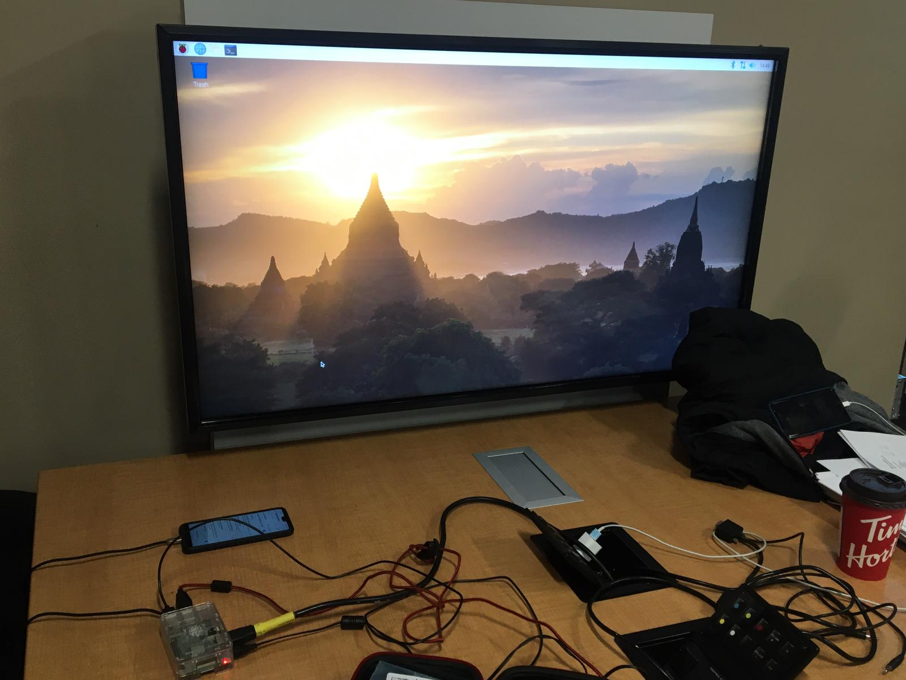
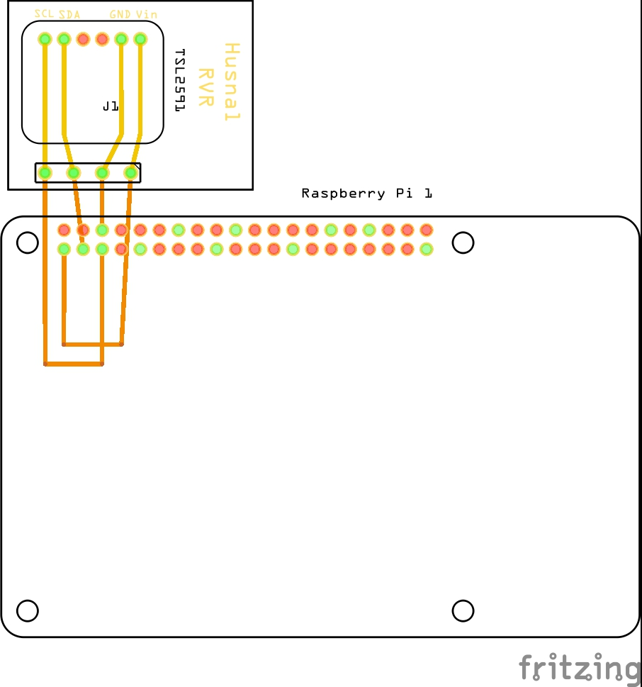
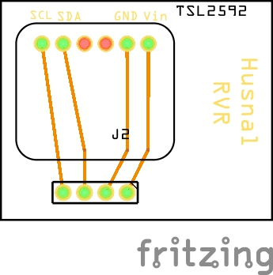
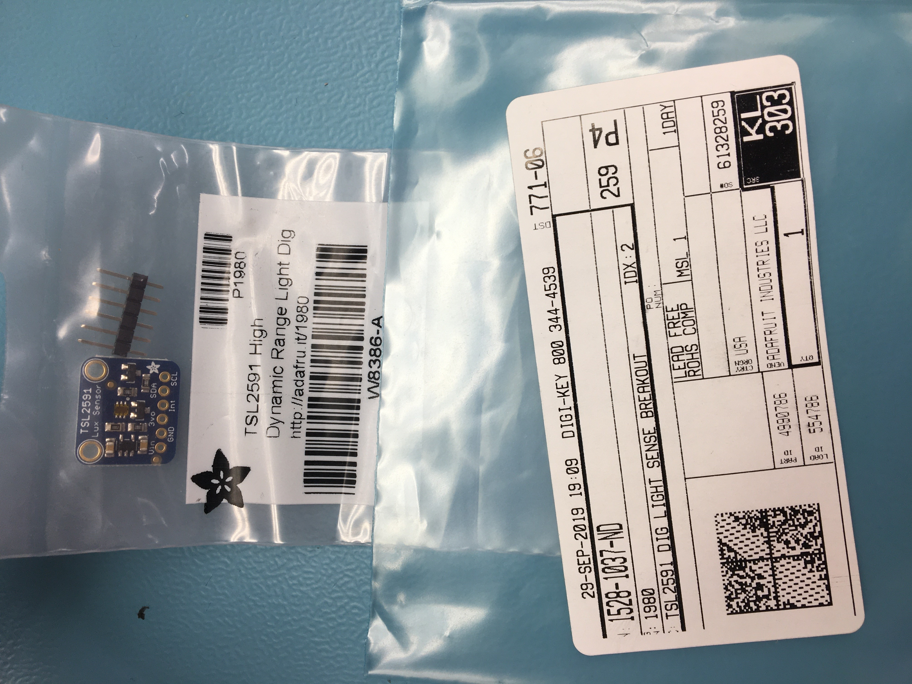
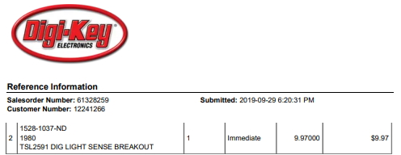

<html>
	<h1 align="center"> Blog Posting</h1>
	
 <b>This project is called Resistor Value Recognizer. It's main functionality is to 
	scan and display the color coded value of a resistor using a camera. </b>

	

	<h3>Blog #11:</h3>
	This week we finally powered up our soldered PCB. My PCB ran perfectly as expected and did not have any issues at all. This project is still on schedule and on track with the proposal. However, as mentioned in the previous blog, I bought a USB3 to Ethernet adaptor from Amazon for $22.66. It was a great adaptor, since it didn't require any downloads on windows to work. The updated budget can be seen here: <a href="https://github.com/HusnalK/Resistor-Value-Recognizer-RVR/blob/master/Documentation/Budget.pdf">
	Budget</a>.The image below is how the adaptor looks like:   
	  
	The following pictures, demonstrate my working powered up PCB.
	  
	  
	
	

	<h3>Blog #10:</h3>
	Down below is my soldered PCB. Everything went smoothly and as planned in the proposal. The project is still on schedule. Did not have any extra expenses. However, I am thinking about buying USB to ethernet from Amazon, so I can have access to my broadcom development platform right from my laptop without the need of a HDMI and periperals.
	  
	  
	 
	

	<h3>Blog #9:</h3>
	
This week I tested my sensors on a breadboard using a testcode I uploaded on the Raspberry Pi. I got this code from the following website<a href="https://learn.adafruit.com/adafruit-tsl2591/python-circuitpython">Testcode</a> and the final python file can be found here: <a href="Software/tsl2591_test.py">tsl2591_test.py</a>   
	 
	

	
 The progress of this project has so far been on track and no extra stuff had to be bought outside of what is given in the budget.
 
	

	<h3>Blog #8:</h3>
	
Finally got around to upload the Raspbian for my Raspberry Pi 3 B+. I used the instrictions found on this link to download the image and then write it on the SD card: <a href="https://www.raspberrypi.org/documentation/installation/installing-images/README.md">Raspbian Download</a>    
	 
	

	<h3>Blog #7:</h3>
	
I got my PCB built by exporting the gerber files from my fritzing project linked in Blog #6. This PCB was built in Humber College's Prototype Lab.  
		<u>Front of the PCB </u> 
	  
		<u>Back of the PCB</u>  
	 
	

	<h3>Blog #6:</h3>
	
I used Fritzing to design my PCB. The Fritzing files can be found here: <a href="Electronics/PCB.fzz">PCB.fzz</a> and <a href="Electronics/PCB2.fzz">PCB2.fzz</a>
		Starting with breadboard as shown below:  
	
	 
	Then I finalized the schematics:  
	
	 
	Lastly, I organized my PCB, exported it as a gerber file and finally, sent it to be made:
	
	
	

	<h3>Blog #5:</h3>
	
Down below is the picture of the resistor which arrived from DigiKey:  
	
	

	<h3>Blog #4:</h3>
	
I made the purchase of my TSL2591 sensor on DigiKey. It is a fairly fast way to get one and they also have a standard cad 8 			shipping rate. The cost can be seen below:  
	
	

	<h3>Blog #3:</h3>	
	
The budget which was decided is shared between me and my project partner can be viewed here:
	<a href="https://github.com/HusnalK/Resistor-Value-Recognizer-RVR/blob/master/Documentation/Budget.pdf">
	Budget</a>		
	

	

	<h3>Blog #2:</h3>
	
The plan for my part of the project i.e. <b> LED Intensity Control using TSL2591</b>
	is shown in the following link: 
	<a href="https://github.com/HusnalK/Resistor-Value-Recognizer-RVR/blob/master/Documentation/CapstoneGProject.pdf">
	Gantt Chart</a>		
	

	
	
	

	<h3>Blog #1:</h3>
	The proposal can be seen on the attached link : 
	<a href="https://github.com/HusnalK/Resistor-Value-Recognizer-RVR/blob/master/Documentation/ProjectProposalHK.pdf">
	Proposal</a> 

	

			<h1><u>
 Repository Created 	
</u> </h1>
			<h3>
 on September 09, 2019
 </h3>
	

			

		
